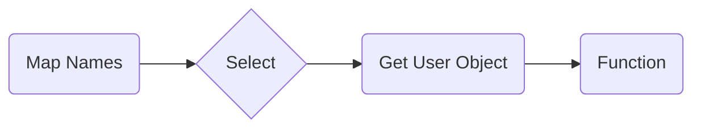
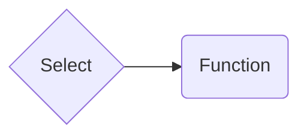

# UI Selector Component

For more details [Go to the Github repository for more information.](https://github.com/vamuscari/custom-angular-ui-with-tailwindcss/tree/main)

## Design Choices

In computer programming, especially in web development and user interface design, a "Select" component is a common user
interface control that presents a list of options to the user. It is often represented by a drop-down list in many
graphical user interfaces. The overall goal of the `<ui-select>` is to provide at least the same functionality of
Angular Material while removing the boilerplate tags. This can really cut down on the size of large form making the overall code much more readable.

In HTML, the Select component is created using the `<select>` element and the options within the select component are
created using `<option>` elements.

Here's an example of a simple select component in HTML:

```html
<select>
  <option value="option1">Option 1</option>
  <option value="option2">Option 2</option>
  <option value="option3">Option 3</option>
</select>
```

Angular Material follows a similar tag system.
Here's an example of a [select component in Angular](https://material.angular.io/components/select/overview):

```html

<mat-form-field>
  <mat-label>Choose one</mat-label>
  <mat-select formControl="selected">
    <mat-option>Clear</mat-option>
    <mat-option value="valid">Valid option</mat-option>
    <mat-option value="invalid">Invalid option</mat-option>
  </mat-select>
</mat-form-field>
```

We can reduce this by using `*ngFor` and defining the options in a typescript file.

```html

<mat-form-field>
  <mat-label>Choose one</mat-label>
  <mat-select formControl="selected">
    <mat-option *ngFor="let option of options" value="option">{{option}}</mat-option>
  </mat-select>
</mat-form-field>
```

Even being consolidated I still find the code above to have way more boilerplate code than I would like. To demonstrate
this here
is a call of the select component in this library.

```html

<ui-select label="Choose one" formControlName="selector" [options]="options" required/>
```

Thus, we have consolidated few element into one element (It will work out about the same on the
clients browser).
If this doesn't convince you that there is a better way then I'm not sure anything will.

### Object Options

When using select components, it's not uncommon for the data to originate from an array of object. Say that you
have a list of friends accounts in a social media app that have things like name, photo, last-active, etc...  
You want the user to select an account from the list, then do something with that object like navigate to its ID.
So we have to send the list of names to the component, then return the index of the name and grab the object.
this can become especially annoying some of the selections are not unique like names.



If we include the object as part of the value then we get the following



A way around this is by allowing the selector to return the value of an Object. In reality this is just bringing the
logic for handling the object into the component.
<details>
<summary>Object Selection in Angular Material</summary> 

```html
<mat-form-field>
  <mat-select formControlName="selectedFriend">
    <option *ngFor="let friend of friends" [value]="friend">
      {{friend.name}}
    </option>
  </mat-select>
</mat-form-field>
```

</details>

What I have gone with for now is to use an addition prop for the field name called `optionsLabelField`. This can either
accept a string for the name of the next field or a callback function if it needs to be more complicated like merging
multiple fields.

```html

<ui-select label="Dropdown Selector" [options]="objectOptions" optionsLabelField="userName" required/>
```

### Not a perfect system

As much as I like this style, I admit there is some flaws to it.

* Performance - I have tested the ui-select on a pixel 5, and they work fine, but I have no idea how well they are handed
  with iOS or older phones.
* Accessibility - One of the great strengths of Angular Material is it
  handles [ARIA](https://developer.mozilla.org/en-US/docs/Web/Accessibility/ARIA). I have made no such attempts to
  include this.


